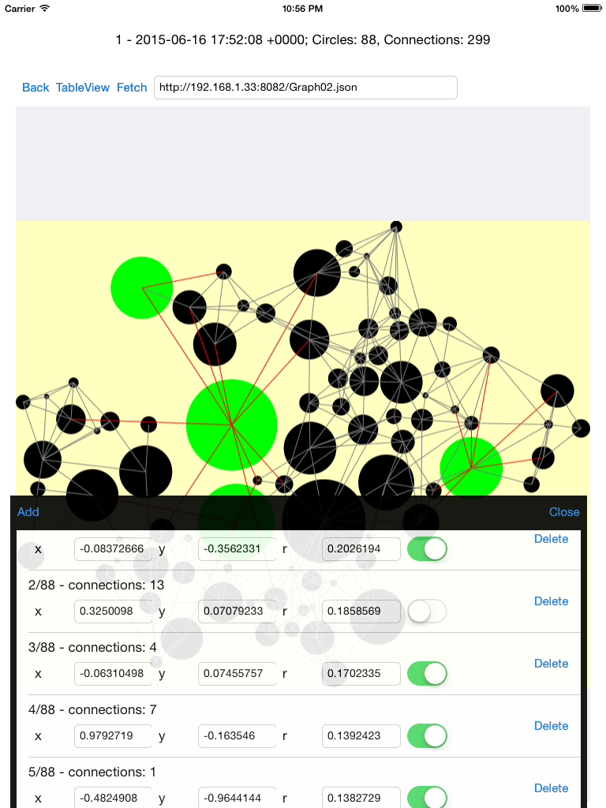

Tue Jun 16 16:43:30 EEST 2015

# IGGeo
IGGeo - iPad - Objective-C native app to handle graphs

Features:
* Inserting and deleting new geos;
* Fetch geo data from URL;
* Drawing graphics;
* Listing Circles in UITableView;
* Add, edit and delete circles in current geo;
* Circles are selectable in List.

Technical:
* Model is persistent using NSCoreData;
* Graphics drawing is done asynchronously in a CALayer using QuartzCore;

Todo:
* some things;

Isidoro Ghezzi

